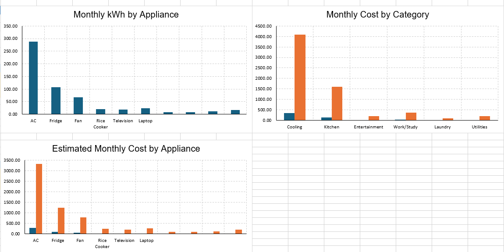

# Kuryentell Energy Dashboard

Kuryentell is a portfolio project that estimates household electricity consumption and monthly cost based on appliance wattage, quantity, daily usage hours, and usage days per month.

## Dashboard Preview

## Overview

This project transforms raw appliance usage data into a simple dashboard for energy analysis and decision-making. It calculates estimated monthly kWh consumption and projected electricity cost per appliance, then summarizes the results through visual reporting.

## Features

- Calculates monthly electricity consumption per appliance
- Estimates monthly electricity cost using a configurable PHP per kWh rate
- Highlights the highest-cost appliance
- Summarizes total monthly kWh and total estimated cost
- Groups usage into appliance categories for easier analysis

## File Included

- `Kuryentell_Portfolio_Project.xlsx` – main workbook containing:
  - Inputs sheet
  - Appliance Data sheet
  - Dashboard sheet

## Formula Logic

**Monthly kWh**

`(Quantity × Wattage × Hours per Day × Days per Month) / 1000`

**Estimated Monthly Cost**

`Monthly kWh × Electricity Rate per kWh`

## Tools Used

- Microsoft Excel
- Spreadsheet formulas
- Dashboard reporting
- Data analysis

## Why This Project Matters

This project shows how appliance-level data can be transformed into actionable insights for:
- household energy monitoring
- cost estimation
- identifying high-consumption appliances
- supporting data-driven decisions

## Future Improvements

- Connect the dataset to Power BI
- Add slicers and more interactive filters
- Add scenario analysis for normal vs high-usage months
- Use real electricity billing rates for deeper analysis

## Resume Description

Expanded Kuryentell into a dashboard-based energy analysis project that calculates appliance-level electricity consumption, estimates monthly cost, and visualizes usage patterns for decision-making.
